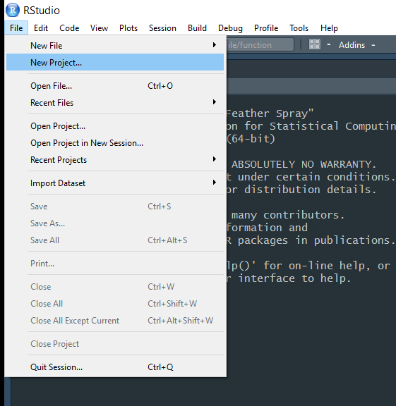
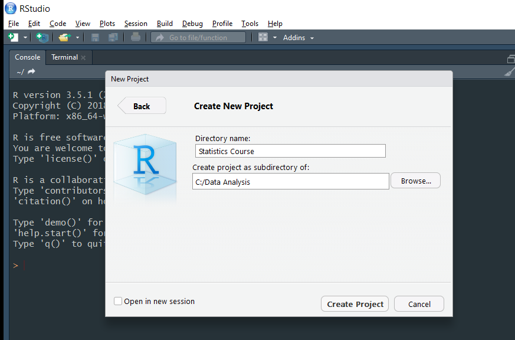
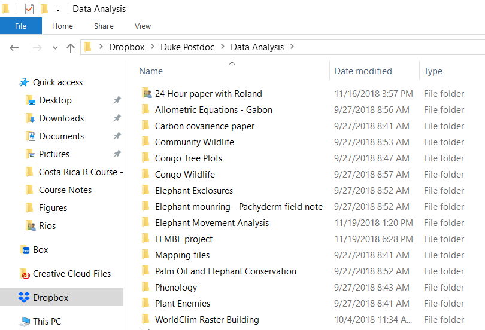
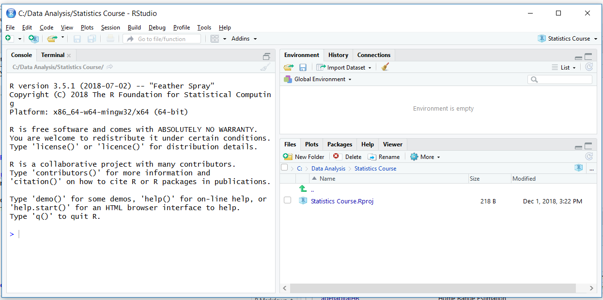
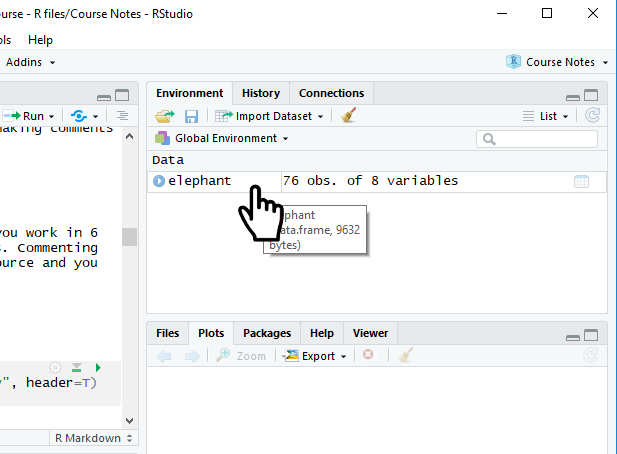

# Setup
Before we get into coding in R, we need to get a few things set up.

## Notation
In the following pages you will meet several font conventions:

- Normal text white background = my comments and notes

- Grey box text = data to be entered into R by run (note #'s make text invisidble to R, but visible to you... more on that later)
```{r, echo=TRUE, eval=FALSE }
# Print Text
print("Hello world!")

```

- White text in 'Courier new' font preceeded by the ## signs = R output
```{r, echo=FALSE, eval=TRUE }
# Simple Addition
print("Hello world!")

```

- ***Bold italic text*** = Tasks / exercises for you to complete

## Download and open R
Before we get into using R studio, it is useful to see what ‘base R’ looks like. Think of R Studio as the fancy packaging, but R as the machine itself.

-	Download and R from <https://cran.cnr.berkeley.edu/>

-	Open R

The most important part to appreciate is the ‘R console’ (see below) - this is the interface between you and the inner workings of R. Everything you do in R goes through this console: your input commands, output and error messages are displayed here. I have increasingly seen people new to R ignoring the console and even having it minimized… This is not a good idea! 

```{r, out.width = '70%',echo=FALSE, }
knitr::include_graphics("Figures/RBasic.png")
```

It used to be that case that all code was directly cut and pasted into the R console, after the ``>`` symbol… try it out! 

```{r}
# Send through a simple command
4+4
```

However, we now have 'R Studio' to make our lives considerably easier!   

## Download and open R Studio
Head to <https://www.rstudio.com/products/rstudio/download/> and download the free 'R studio desktop edition', install it and run it.

R Studio looks more complicated than the basic R GUI, but all of these elements are there to make your life easier. Do not worry about what these things mean, we will address each in turn below.

## Setting up R Studio to be productive
We will now set up our R workspace so that we can start coding! There are lots of different work-flows in R, some better than others. I am not going to show you everyway of doing things... just my way!

### R Projects
I can work on multiple different projects simultaneously as I use 'projects' in R studio. Think of a project file as a box into which you put everything you need to perform analysis for given a paper or report. 

'Projects' are useful as you can have multiple completely independent projects open at the same time - the data and workspaces  are not shared.

***First, make a folder called "Data Analysis" inside your normal work folder.***

Click on 'File' then 'New Project'

```{r, out.width = '65%',echo=FALSE }

```

Click on 'New directory' then click on 'New Project'. Call your new project something original like "Statistics course" then point the subdirectory to your newly created "Data Anlysis" folder.

```{r, out.width = '60%',echo=FALSE }

```

Then click **Create Project**.

We are going to use this 'Statistics Course' Project to save all of the code and analysis which we will perform over the next three days.

Whenever you start on a new data analysis project - you MUST make a new projects file!  For example, my folder currently looks like this:

```{r, out.width = '60%',echo=FALSE }

```

Each folder contains one (or more) project files which I use to do my data analysis. I promise this will simplify your life and avoid confusion!

You can also share this folder with collaborators so that they can run all of your code without changing file paths... or share it with me if you are getting stuck on something!

Your R Studio window should now look like this:

```{r, out.width = '75%',echo=FALSE }

```

You can see the original 'R console' on the bottom left-hand side.  

### Create a data sheet to save your code
We could start by typing our data straight into the R console. But it would not easily be able to see the work we have done, or repeat the analysis in the future. A much better idea would be to save your data in a worksheet! 

To do this we need to create an ".R" file.

Click on 'File' -> 'New File' -> 'R Script'    *or* 'Ctrl+Shift+N'

Before you do anything else... save this sheet! Call it 'Session 1 - Basic R'

Your R studio will now look like this:

```{r, out.width = '75%',echo=FALSE }
knitr::include_graphics("Figures/Session 1 - Basic R.png")
```

**We are now ready to code!**

### Name your files 

You should always give your code sheet a title. I follow the following convention:

```{r, echo = T }
# Title: Basic R Coding
# Date: 1st December 2018

```

The first universal rule of working in R is:

**Always comment your code**

The ``#`` symbol makes whatever you have written invisible to R. If you do not do this, you'll come back to you work in 6 months and have no idea what any of it means. Commenting your code will mean your past work is a valuable future resource and will make you feel less overwhelmed.

The second universal rule is:

**Put spaces inbetween your code**

Squashingeverythingintoonelinemakesitverydifficulytoread. Although saving space is economical, it is buch better to be clear.

Use linebreaks and spaces to make the structure and logic behind your work clear.

## First Steps

Import the data set:

```{r}
elephant <- read.csv("ClassData/Elephant.csv", header=T)
```

To run your code hit 'Ctrl+Enter' *or* click the 'Run' command in the top line of the R sheet. 

You can run multiple lines of of code at one by highlighting them and pressing 'Ctrl+Enter'. 

### Veiwing Data

I see students opening their data in Excel to look at it *all the time*, but it is very easy in R!

We can take a quick look at our data using the ``head()``. It prints the first few lines of a dataframe, and gives you a good snapshot of what is going on.

```{r}
head(elephant)
```

We can take a more in-depth, excel style, look by clicking on the 'elephant' dataframe in the 'Environment' frame (top right).

```{r, out.width = '60%',echo=FALSE }

```

### Data summaries

Let's explore the ``elephant`` data! First, we want to know how many elephants of each sex, the largest recorded group size, and the mean tusk length in our dataset.  

***Enter the following into R***

```{r}
table(elephant$Sex) # How many male/female elephants?
```

```{r}
max(elephant$GroupSize) # What is the largest group size?
```

```{r}
mean(elephant$TuskLength) # What is the largest tusk length in the dataset?
```

Let's now calculate the average tusk length for males and females. We can use the ``aggregate()`` function to calculate mean tusk lengths separately for each sex.

```{r}
# Average tusk length by sex

aggregate(formula= TuskLength ~ Sex,
          data=elephant,
          FUN=mean)

```

### Plot your data

Let's make a plot of home range size versus tusk length.

```{r, out.width = '60%'}
plot(x = elephant$TuskLength, y = elephant$HomeRange) # simple r scatter plot
```

Interesting... but not very pretty. Lets clean it up.

```{r, out.width = '60%'}
plot(x = elephant$TuskLength, y = elephant$HomeRange,
     main = "My first nice R plot",    # Main heading               
     xlab = "Tusk length (m)",         # X-axis label
     ylab = "Home range size (km2)",   # Y-axis label
     pch=19,                           # Filled circles 
     las=1                             # Rotate y-axis labels
     ) # simple r scatter plot
```

### Test your hypotheses

Let's do some basic hypothesis testing. First we will perform a two-sample t-test to see if male elephants and female elephants have different group sizes.

```{r}
t.test(formula = GroupSize ~ Sex,
       data = elephant,
       alternative = 'two.sided')
```

Our p-value of 0.7556 suggests that we do not have sufficent evidence to say there is a difference in group size between males and females.

Next, lets see if there is a correlation between the tusk length of an elephant and its home range size.

```{r}
cor.test(formula = ~ TuskLength + HomeRange,
         data = elephant)
```

We got a p-value of 3.021e-08, which is P < 0.00000003. Which means that it is very unlikely that the positive relationship between tusk length and home range size came about by chance. Tusk length predicts home range size.

### Regression analysis

Finally, lets run a full regression analysis to see if home range size is infleuced by sex, tusk length and an elephant group size.

```{r}
# Fit the model
reg.model <- lm(formula = HomeRange ~ Sex + TuskLength + GroupSize,
                    data = elephant)

#Show the summary statistics
summary(reg.model)

```

The only strong predictor of elephant home range size is tusk length!

### Congratulations

**You are an R programmer!**

We just imported a data set, explored it and did some basic analysis in no time at all! R is amazing... if you know what you are doing. 

Let's take a few steps back and start learning the basics.