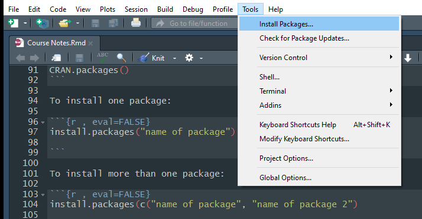

# R Basics
R has some quirks which you should understand before we continue:

- Anything that follows a ``#`` on the command line is taken as a comment and ignored by R. Comments can be included almost anywhere. In R Studio when you insert a ``#`` symbol the line changes colour (default = green) so that you know it is a comment.

- R is a case sensitive language. i.e. ‘A’ is not the same as ‘a’ and can be used to name different variables

***Try running the following***

```{r, eval=F}
A <- "Be careful with captials"
a
```

-	Separate commands should be separated by a new line (but you can also use a semicolon ;)

- A very common problem is that you try to run something and nothing happens. A frequent cause if this is that you did not finish your statement, and R is waiting for additional information. When this happens a continuation prompt ``+`` will appear  as your command is not complete. Usually you have forgotten to close a bracket! So R has two states: **ready (>)** or **wating (+)**. If you have this issue, the best thing to do it hit escape, try to correct the problem, and try again.  

```{r, out.width = '30%',echo=FALSE, fig.align='center' }
knitr::include_graphics("Figures/R is waiting.png")
```

 - Always troubleshoot your code. Never assume anything has worked... **always check it!**

## Quick Glossary

- ``<-`` is the 'gets function'

- ( and ) are 'brackets'

- [ and ] are 'square brackets'

- "" are 'quotation marks'

- ``folder/folder/Your data.csv`` is a 'filepath'

 
## Objects and functions

R deals with two key elements: objects and functions: 
  
  - **Objects** are packets of data (numbers, text, dataframes etc) stored in the 'global environment'.
  
```{r}
object <- c(3,4,6,7)
```
  
  
  - **Functions** are proceedures which you apply to objects to return a new, altered, object. For example ``mean()`` will take an object containing lots of values, take the average, and retun it for you to see or assign to a new object.  

```{r}
mean(object)
```

As you get more comfortable in R, the functions you apply will get more and more complex, however the fundamentals remain the same: take an object -> apply a function -> store/interpret the results. 


## R as a calculator

The easiest way to use R is as a calculator. Write the following into your R script file:

```{r, echo=T}
# Addition (ALWAYS COMMENT YOUR CODE!!!)
2+2
```

***TASK 1***
***Try out the following functions: multiplication ``*``, subtraction ``-``, division ``/``, logarithm ``log()``, exponent ``exp()`` and square ``^`` ***


## Assigning single values (a.k.a. scalars)

What if we want to store the results of our calculations? We have completed our calculations, but none of them have been saved in the workspace. Look at the "Environment" in the top right... It only has the ``elephants`` dataset set from earlier. Where are our results?

To assign a single value to a variable or 'object' we use the 'gets' operator **``<-``**

```{r}
# The gets operator
b <- 4    # Literally object 'b' gets 4
```

Look at the global environment now! It has something in it: ``b``. Objects with a single value are called 'scalars'.

Check what information the scalar, ``b``, contains:

```{r}
b
```

Lets increase the value of ``b`` by two
```{r}
# Remember b = 4
b + 2 

```
 
We get the answer 6... Great. Let's double check what b is...

```{r}
b 
```
b is still four because we didnt update it! **Remember** to change an object you **MUST UPDATE IT WITH THE GETS FUNCTION!**. The correct way to do this is:

```{r}
b <- b + 2 # The proper way to update an object
b
```


You can create objects with expressions too:
```{r}
c <- log(8)
c
```

Once you have objects in your workspace (i.e. ``b`` and ``c``), you can do arithmatic with them... more on this below:

```{r}
b + c
```


## Assigning multiple values 

### Concatenation (a.k.a. vectors)

This is one of the most important operators: ``c()`` . I means to concatenate or link together. It allows you to link multipe values into a vector. Vectors are objects with multiple values.

```{r}
w <-c(2,3,1,6,4,3,3,7) #creates a vector with these numbers
w

```

If you perform an operation on a  vector (multiple value object) with a scalar (single value object), R will cleverly apply the scalar to each element in the vector. For example, if you have a vector and want to add 100 to each element, just add the vector and scalar objects. Let’s add 100 the ``w`` variable we just created: 

```{r}
w + 100 # vector + scalar
```


### Sequences

Sometimes you will want to generate repeated sequences of number or words. There are several ways of doing this.

1. A regular sequence of integer values ``:``

```{r}
d <- c(1:10)	# create a vector of whole numbers from 1 to 10
d

```

2. A sequence of non-integer values ``seq(from, to, by, length.out)``

```{r}
e <-seq(from = 1,
        to = 5,
        by = 0.5)	# create a sequence from 1 to 5 in 0.5 steps
e                 # Note : length out controls the number of elements in your sequence

```


3. A series of repeated elements ``rep(X, times, each, length.out)``

```{r}
e <-rep(x=2,times=10)	# repeats x 2, 10 times
e

```

4. Non-numeric sequences can also be produced

```{r}
f <- rep("Osa Conservation",times=3)	# repeats abc 3 times
f

```

5. Repeat a series of repeats of a sequence

```{r}
g <-rep(c(1:5),times=3)	# repeats the series 1 to 5, 3 times
g

```

6. Repeat the individual elements of a series

```{r}
h <-rep(1:5,each=3) # repeats each element of the series 3 times
h

```

Summary table of the functions to create vectors
```{r, echo=F}
library(knitr)
kable(data.frame(Function=c("c(a,b,...)", "a:b", "seq(from, to, by, length.out)", "rep(x, times, each, length.out)"), 
                 Example=c("c(1, 5, 9)", "1:5", "seq(from = 0, to = 6, by = 2)", "rep(c(7, 8), times = 2, each = 2)"),                  Result=c("1, 5, 9", "1, 2, 3, 4, 5", "0, 2, 4, 6", "7, 7, 8, 8, 7, 7, 8, 8" )))
```


***TASK 2***
***Sequence challenges***

### Vector Arithmatic

Vector arithmatic very important to get the hang of - you can perform the same function to multiple values simulteneously!

```{r}
x <- c(1,2,3,4)
y <- c(5,6,7,8)

x*y
x-y

```


### Vector Summaries

Some typical functions used with vectors include ``mean()``,``var()``, ``sd()``,``range()``,``length()``,``max()``,``min()``, ``summary()``. I use ``summary()`` and ``length()`` very frequently.

***Task 3***
***Try out all of the data summary functions listed above on the following dataset... remember to write notes for each example!***

```{r}
i <- c(1,2,2,3,4,5,6,6,6,7)

#Example
mean(i) # gives the average

```

### Ordering and manipulating vectors

If you want to become a proficcient R user, knowing how to manipulate data is **essential!** You will use all of the following commands frequently... be sure to practise them.

#### Extracting values

You will frequently need to extract particular elements from a vector. In order to extract a single element use square brackets, ``[ ]``, containing the position, or index, of the element. For example:

```{r}
i[3] # Takes the third value out of the "i" datastring defined above
```

To extract a sequential range of values:

```{r}
i[c(3:9)]	# extracts the values of elements 3 to 9
```

To extract a non sequential range of values:

```{r}
i[c(2,4,6,8,10)]	# extracts the values for elements 2,4,6,8,10
```

#### Extracting values using logic 
**The importance of this can not be overstated!** R gives you the power to subset data using logical statements. 

```{r}
i[i>4] # extracts all values which are greater than 4
```

```{r}
i[i==6] # extracts all values which are equal to six
```

The key logic arguements are listed below:
 
```{r, out.width = '30%',echo=FALSE }
knitr::include_graphics("Figures/Logic Statements.png")
```

*** Task 4***
***Try to run an example of each of the commands listed above***

#### Sorting values
Vectors can be  ordered using the functions ``sort()`` and ``rev()``.
Some examples are given below:

```{r}
y <- c(4,2,5,6,4,3,5,6,7,4,3)
sort(y) # Places all values in ascending order

```

```{r}
rev(sort(y)) # Places all values in descending order.  rev() = reverse

```

To be honest, I very rarely use ``sort()``, I find ``order()`` to be much more useful. Have a look at the output below:
```{r}
height <- c(180,155,160,167,181)
order(height) 
```

To interpret this, lets start with the ``order(height)`` output. The first value, 2, (remember ignore [1]) should be read as ‘the smallest value of height is the second element of height’. If we check this by looking at height, you can see that element 2 has a value of 155, which is the smallest value. The second smallest value in height is the 3rd element of height, which when we check is 160. The largest value of height is element 5 which is 181.

```{r, out.width = "250px",echo=FALSE }
knitr::include_graphics("Figures/Ordering.png")
```

Now suppose the variable height is the height (in cm) of five different women. We know the names of these women and can store their names in a variable called w.names.

```{r}
names <-c ("Joanna","Charlotte","Helen","Karen","Amy")
```

Now we can order the names of the women according to their height

```{r}
height.ord <- order(height) # creates a variable of ordered height
names[height.ord]
```

You are probably thinking ‘what’s the use of this?’ Well, imagine you have a dataset which contains two columns of data and you want to sort each column. If you just use ``sort()`` to sort each column separately, the values of each column will become uncoupled from each other. By ordering one column and then ordering the other column based on the value of the first column you will keep the correct association of values. More on this later!

#### Subsetting elements in a vector
There are times when your variables may be too long, or you want to create a new column. ``substr()`` command is very useful to know. It works as ``substr(data, starting character, ending character)``:

```{r}
# substring
substr(names,1,3)
```

#### Switching to upper/lower case
There are some very useful commands to standardise variables in a dataset. Try out the following:

```{r}
# Switch 'names' to lower case
tolower(names)

# Switch 'names' to upper case
toupper(names)

```

#### Removing whitespace
Sometime entering data into excel, you create variables with whitespaces in. They can be very difficult to detect, and R will treat them as different. For example, "Johanna", "Johanna " and " Johanna" will be treated as different factor levels by R. You can remove these with ``trimws()``:

```{r}
# Remake the 'names data frame with white spaces
names <- c("Johanna", "Johanna ", " Johanna", "Jo Hannah")
table(names)
```

```{r}
# Correct the problems with trimws(), note trimws() only deals with spaces at the start 
# or the end!
names <- trimws(names)
table(names)

```

### Removing objects from the workspace

Through out this session we have been adding things to our workspace... Check out the global environment in the top right! What if we want to remove things to keep things tidy? 


```{r}
rm(names) # Removes a single object

rm(b,c,d) # remove multiple objects using a comma.

```

***Task 5***
***Practise creating sequences of information and subsetting them***

## Quitting R

When you are finished with R, save your worksheet and close R. R Studio will ask you if you want to save your workspace image. This saves all of the files in the 'Global environment' (on the right) for when you open the project next time. If you do not do this, you will have to re-run all of your code each time you load R. 


## Packages

More often than not, you will need to look outside of 'base R' in order to perform certain functions or analyses. To do this we need to download a 'package' into R.

If you want to see the (ever expanding) list of packages available in R, type in: 

```{r, eval=FALSE}
CRAN.packages()
```

### Install your first package

We will new install 'dplyr' - a package which will use later. Do not worry about what it does for now! 

To install a package:

```{r , eval=FALSE}
install.packages("dplyr")

```

Packages are updated frequently, to update yours type:

```{r , eval=FALSE}
update.packages()

```

Or you can install packges through the 'Tools' heading:

```{r, out.width = "425px",echo=FALSE }

```

### Loading a package
You will realise that just because you have installed a package does not mean you can actually use it. This is to prevent R taking up lots of computer memory with packages you are not currently using. To load a package into the workspace (and therefore make it available) you must run the following:

```{r}
library(dplyr)
```

It is now unpacked and ready to use!

To see a list of active packages, click the 'Packages' tab in the bottom right-hand corner.

## Getting help
Use the question mark.

```{r echo=TRUE, results='hide', message=FALSE, eval=FALSE}
?plot
```

This opens an interactive display in the bottom right hand corner of R studio. 

```{r, out.width = "425px",echo=FALSE }
knitr::include_graphics("Figures/Help.png")
```

Although daunting at first, this information is actually very useful:

**Description:** gives a brief description of the function.

**Usage:**	gives the name of the arguments associated with the function and possible default values (options).

**Arguments:** provides more detail regarding each argument.

**Details:** gives further details of the function.
 
**Value:**		if applicable, gives the type of object returned by the function or the operator.

**See Also:**	provides information on other help pages with similar or related content.

**Examples:**	gives some examples of using the function. You can also access examples at any time by using the example() function (i.e. example(plot))

I most frequently veiw the **Arguements** and **Examples** tabs.


If that does not help... **google it**!
