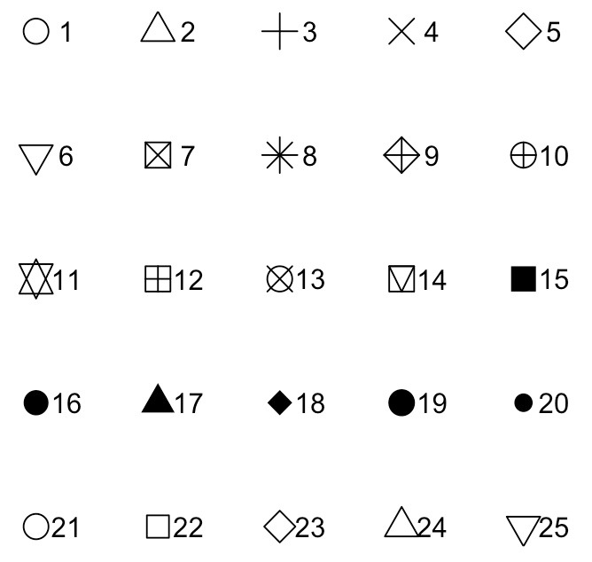

# Advanced coding 
So far we have been dealing with single value scalars or multiple value vectors created in R. But what if you want to start importing and analysing more complicated datasets collected in the field? We first need to learn how to import and analyse our data.

## Classes of data

Data in R come in two principal flavours: numbers (usually integer or continuous) and strings (uausally characters or factors). They each behave in slightly different ways. It is very important to know when and where to utilise them, and how to convert between them.

### Numbers
A numeric object is any integer (e.g. 7 or -4) or real number (e.g. 3.14). You do not have to do anything special to create a numeric object, if a column contains only numbers it will be classed as numeric.

```{r}
a <- c(1,2,3) # generate a vector of pure numbers
class(a) # check the class of the data
```

Beware! If there are non-numbers in the data to, it will be treated differntly by R. This is a common issue when you import a dataset which contains data entry errors. The column you expected to be classed as numeric is classed as a 'character' object.

```{r}
a <- c(1,"f",3) # generate a variable with some data
class(a) # check the class of the data

```

### Strings

Strings can take several forms, but the dominant types are characters and factors. 

### Characters
Characters are strings of letters and numbers and can take any unique combinations. They are very flexible, easy to deal with and always require quotation marks "".
```{r}
b <- c("Dave", "Brian", "John")
b 
class(b)

```
A very common reason for code failing is forgetting the ``""`` quotation marks when referencing a character string. When you do this, R will look for the word you have typed in the global environment - it thinks it is an object! If it isn't there, it will retun an error:

```{r, eval=FALSE}
c <- c(Dave, Brian, John) 
```
Error: object 'Dave' not found

 
### Factors
Factors are superficially similar to character strings, but rather than being flexible, they have ordered levels hard-wired into their data structure.  

```{r}
c <- factor(c("Dave", "Brian", "John"))
c # Note the 'Levels:' output which tells you what values the different factors can take.
class(c)
```
You can also find out what the different levels are inside a factor using 'levels()'

```{r}
levels(c)
```

The way to think about factors is as a set of labelled drawers holding the data. The draws are references one to the number of drawers, and if you remove all the data from a given draw, the draw remains in the dataset to be filled again.

Let me show you this by changing "Brian" to "Dave":

```{r}
c[c=="Brian"] <- "Dave"
c
```

We no longer have a "Brian" in the dataset, but the level "Dave" remains to be used. We can remove an empty level in a set of factors using the ``factor()`` commond:

```{r}
c <- factor(c)
c
```

### Changing data structure
There comes a time in every coders life when you need to switch the nature of your data from one type to another. This is easily accomplished by using the 'as.character()', 'as.factor()', and 'as.numeric()' commands.    

```{r}
# Create a numeric vector
d <- c(2,6,8,5,5,5,6,7,8,5)
d # all looks normal
class(d)
```
As expected... it is numeric. Let's change it to a character string.

```{r}
# Create a numeric vector
d <- as.character(d)
d # Note how there are now ""'s around the numbers.
class(d)

```
Change it to a factor.
```{r}
# Create a numeric vector
d <- as.factor(d)
d # Note how now we have levels!
class(d)

```
Complete the circle, and change it back to numeric.

```{r}
# Create a numeric vector
d <- as.numeric(d)
d # WHAT!!!???!! The numbers have changed.

```
Never change a factor to numeric like that. The numbers the values take are the "levels" contained within the factor. **THIS IS WHY YOU SHOULD ALWAYS TROUBLESHOOT YOUR CODE**. If you do need to go from a factor to numeric, always use 'as.character()' as an intermediate command first.

## Dataframes
Dataframes sound a little dull... but they are actually powerful two dimensional vector holding structures! They will be the most common way you store data in R. Other ways of storing data exist (e.g. lists, matrices), but I will not discuss them here - just be aware they exist! Dataframes are composed of rows and columns and can contain data of different types (e.g. numeric, character and factor), whereas vectors must always be the same data type.

### Exploring dataframes
If you want to become proficient data analysis, you need to become a pro at the exploration and manipulation of dataframes. To do this properly, you will need master a range of different R techniques, from data summarisation to plotting. Tomorrow we will do this on a real dataset. Today, we will keep working on our elephant dataframe. 

Let's import and examine the structure of the elephant dataframe:

```{r}
elephant <- read.csv("ClassData/Elephant.csv", header=T)
head(elephant)
tail(elephant)
```
The dataset above contains the results from one year of tracking elephants with GPS collars in Gabon. The dataframe has 7 variables (columns) and each row represents data from an individual elephant.The variables ``Name``, ``Sex`` and ``Region`` are catagorical. ``HomeRange``, ``NDVI``, ``TuskLength`` and `GroupSize`` are continuous.  

### Numerical Summaries
The first thing we should do is examine the data structure using 'str()'

```{r}
str(elephant)
```

When we imported the dataframe, R automatically defined the catagorical variables as 'Factors' and the continuous variables as numeric ('num') or integer ('int'). There is no practical difference between numeric and integer, just that integers do not have decimal places. 

The 'str()' command gives you the number of observations (rows) and variables (columns). We can also extract this information with:

```{r}
nrow(elephant) # number of rows
```
```{r}
ncol(elephant) # Number of columns
```

If you want a summary of all of the information in your dataframe, you can use the 'summary()' function. For continuous variables you get the mean, median and range of values, for catagorical variables you get the frequency within each category:

```{r}
summary(elephant)

```

### Selecting entries in a dataframe

#### Columns
To select a single column you must provide its **full address**. The name of the data frame is the 'city' (in this case ``elephant``), the column name is the street. You link them with the '$' sign.

```{r}
elephant$Name
```

R studio is very helpful and provides you with column title hints after you have typed the '$' sign, but even so, you should always keep your column titles small in order to save time and keep your code looking clean.

```{r, out.width = "250px",echo=FALSE }
knitr::include_graphics("Figures/hints.png")
```

#### The cordinate method
You can also select elements from dataframes using their coordinates (also known as indexing or subscripting). To do this you use the [ ] square brackets. Again you must specify the address (the data frame), then the rows (x) and/or column (y) coordinates. **dataframe[row.number, column.number]**

For example, to extract the 2nd row's 3rd element:

```{r}
elephant[2,3] #coordinate method
```
You can select the whole row by leaving the column argument blank.

```{r}
elephant[2,] #just the 2nd row
```
Or select the whole column by leaving the row argument blank.

```{r}
elephant[,3] # just the third column
```

If you want to extract more than one column and row you can use supply vectors:
```{r}
elephant[c(1:3),c(1,3,5)]

```


#### The logic method
One of the most powerful ways to extract data in R is to use logical statements. For example, let's subset the data to only include males:

```{r}
elephant[elephant$Sex=="Male",] # subset to just males. Remember that leaving a blank 
                                # space after the , returns all columns
```

Let's subset the data to only include elephants with home ranges greater than 500km2:
```{r}
elephant[elephant$HomeRange>500,] # Home range greater than 500

```

You can link multiple logic statements together with the '&' sign. Extract elephants with homeranges greater than 500km2 *AND* tusks over 1.5m:
```{r}
# Home range greater than 500 and tusk length  great than 1.5
elephant[elephant$HomeRange>500 & elephant$TuskLength>1.5,]
```

If we want to extract elephants with tusks great than 2 meters **or** less than 0.5 meters? Easy! Use the or '|' operation:

```{r}
# elephants with tusks greate than two meters, or less than 0.5 meters.
elephant[elephant$TuskLength<0.2 | elephant$TuskLength>1.5,]
```

The '%in%' operation helps you to easily extract data based on multiple OR arguments. Imagine you have a list of elephants that you know were poached, and you want to subset the data to only view those.

```{r}
poached <- c("David", "BraBrou", "Ekare") # create a vector of poached elephants
elephant[elephant$Name %in% poached,] # subset using %in%
# Return all rows where elephant name matches the names in poached

alive_elephants <- elephant[!elephant$Name %in% poached,]
```

***TASK 6***
***Extract the data for female elephants in Wonga wongue.***


### dplyr and data summaries

So far we have just used functions contained in base R, but the package ``dplyr`` within the ``tidyverse`` (more on this later) has a lot to offer.

```{r, results='hide', message=F}
library(dplyr) # Load the dplyr package
```

First we will summarise home range and tusk length by park using the summarize function:

```{r}
summarize(group_by(elephant, Region), # this says calculate the following using the 
                                      # elephants dataframe, split by region 
          Individuals=n(),            # give the number of individuals 
          Avg.Area=mean(HomeRange),   # average Home range
          Avg.Tusk=mean(TuskLength))  # average tusk length
```

We can add increase the number of summary subdivisions easily too:

```{r}
summarize(group_by(elephant, Region, Sex), # this says calculate the following using the 
                                           # elephants dataframe, split by region 
          Observations=n(),#give the number of Observations in each group 
          Avg.Area=mean(HomeRange), #average Home range
          Avg.Tusk=mean(TuskLength)) #average tusk length
```

###TASK 7###
###Summarize group size by region###


#### Dealing with NA's
Try to find the average NDVI score across all elephants:

```{r}
mean(elephant$NDVI)
```
Whaaat?! **R is broken...** Not really. One of our elephants is missing an NDVI score. This is very common in real world data where the complexities of life sometimes get in the way of data collection. NA's often sneak under the radar in datasets (particularly if you analse data with 1000's of observations).

You can easily adjust the ``mean()`` command to ignore NA's:

```{r}
mean(elephant$NDVI, na.rm=T)
```

However, what if you want to find the problem and correct it? Or remove it completely? We can try to use logic like in the previous examples:
```{r}
elephant[elephant$NDVI=="NA",] # Subset the data where the NDVI score is NA

```
That didn't work. NA's do not behave like normal data. You need to use the logical statement 'is.na()' to evaluate NA's. First lets look at what is.na() does:

```{r}
is.na(elephant$NDVI) # what is.na does
```
It produces a vector of true and false statements, if NDVI is not an NA it returns 'FALSE', if NDVI is an NA it returns 'TRUE'. We can use this information to make our selection!

```{r}
elephant[is.na(elephant$NDVI)==TRUE,]
```

Now we see the real data!

Remove the NA from the dataset:

```{r}
elephant <- elephant[is.na(elephant$NDVI)==FALSE,] # subset the data where is.na() is false.
```

In summary, NA's behave strangely, but dont get flustered by them. You just need to be vigilent and know how to deal with them.

### Merging dataframes
Taking data from one source and merging it with another source is a fundamental step in performing data analysis. For example, you have collected lots of biodiversity data in the field and you want to merge it with some covariate data exported from ArcGIS.

In this case, your elephant project collaborators have just provided you with data on the disease status of the individuals in your data set, and you need to add it to your dataframe.

***Import the ``disease`` dataframe.

```{r}
ele.dis <- read.csv("ClassData/Elephant.disease.csv", header=T)
```

###TASK 8###
*** Explore the new dataframe with the ``str()`` and ``head()`` functions. What can you tell me about it?***

In the past you might have opened the two files in excel and copied the data over... but what if the data are in different orders, have repeated individuals, or there are 1000's of rows? It would be a nightmare! We can do something much simplier in the ``dplyr`` package - a left join. ``Left_join()`` takes two datasheets and merges them using a common key (in this case ``Name``), to add any columns from the right hand side (``ele.dis``) not present on the left hand side (``elephant``).

```{r}
# First load the package
library(dplyr)
new.ele <- left_join(elephant, ele.dis, by="Name") # by specifies the key
head(new.ele)
```

***Always check the output is sensible***

Magic! There are other types of joins you can use, but this is the one which I use most frequently. For more ideas check out <http://stat545.com/bit001_dplyr-cheatsheet.html>

### Exporting dataframes
Take the updated elephant dataset you have just produced and use the ``write.csv()`` command. The arguments contained are ``write.csv(object, "name.csv", row.names=F)``

If you do not use a file in your write csv() the file will turn up in the project directory. However you can write it to any folder on your computer using a file path.

```{r, eval=F}
write.csv(new.ele, "C:/Program Files/Home Range and Disease.csv", row.names=F)

```


## Plots
Summarising your data, either numerically or graphically, is an important (if often overlooked) component of any data analyses. Fortunately, R has excellent graphics capabilities! It can be used when you want to produce plots for initial data exploration, model validation or highly complex publication quality graphs. 

If you can imagine a graph... you can plot it in R! Consequently it would be impossible to go through all possible combinations here. This will simply serve as a primer.

### Scatter plots
The most common function used to produce graphs in R is the plot() function. The simplest plot is a single variable plot - e.g. elephant home ranges:

```{r,  fig.width = 4, fig.height=3}
plot(elephant$HomeRange)
```

Here, R has plotted home range size on the y axis and an index (1 to the length of the dataframe) on the x axis, plotted in the order at which they occur in the data. 

We can provide a second continuous variable (a scatter plot) with the following:

```{r,  fig.width = 4, fig.height=3}
# You can use plot(x,y) or plot(y~x), they produce the same result.
#plot(elephant$HomeRange~ elephant$NDVI) # Will give the same result
plot(elephant$NDVI,elephant$HomeRange) # Scatter plot of two continuous variables
```

You can also specify the type of graph you wish to plot using the option type=””. For example, you can plot just the points (type=”p”), lines (type=”l”), both points and lines connected (type=”b”) and both points and lines with the lines running through the points (type=”o”).

```{r, fig.width = 6, fig.height=7 }
par(mfrow=c(2,2)) # allow a plot with four windows
plot(elephant$HomeRange, type="p", main="Points")
plot(elephant$HomeRange, type="l", main="Lines")
plot(elephant$HomeRange, type="b", main="Points and lines 1")
plot(elephant$HomeRange, type="o", main="Points and lines 2")
```

#### Histograms

The hist() function allows you to draw a histogram of a variable in order to gain an impression of its frequency distribution. To plot a histogram of height.

```{r, fig.width = 4, fig.height=3}
hist(elephant$NDVI, main= "Histogram of NDVI score") #default histogram
```

You can manually change the number of breaks in a histogram by supplying a sequence spanning the range of the variable of interest.

```{r, fig.width = 4, fig.height=3}
brks <- seq(0.5,1,0.02) # This sets the break width
hist(elephant$NDVI, breaks=brks,  
     main= "Histogram of NDVI score")

```

#### Boxplots	
Boxplots are useful for exploring how a continuous covariate is related to a catagorical covariates. They are specified as 'boxplot(continuous~catagorical)'. **Note* you have to use the ~ with boxplots or you get weird results.

```{r, fig.width = 3, fig.height=4}
boxplot(elephant$TuskLength~elephant$Sex, ylab="Tusk Length (m)") # ylab controls the axis labels

```

To interpret a box plot: The cental black bar = median, the upper and lower edges are the 25% and 75% quartiles, the whiskers are 1.5 the interquartile range, circles beyond the whiskers denote values > 1.5 times the interquartile range from the median (sometimes callled outliers).

Use '?boxplot' to see all of the different boxplot cutomisation options.

```{r, eval=F}
?boxplot # use the help call
#wow there are lots of things to change!
```

#### Correlation plots
When analysing data sets with large numbers of continuous variables, it is often important to determine whether any of them are related to one another. Plotting multivariate data in excel is a nightmare, but it is very easy to do in R using the 'pairs()' function.

```{r}
pairs(elephant[,3:7], # specifies the panels you wish to plot 
      panel = panel.smooth) # adds a smoothed average line to 
                            # help you understand the relationship

```

These plots take a while to get used to but are very useful! You can see home range and NDVI are positively correlated. Note - catagorical covariates are treated as numeric (look at region), and are therefore of limited use in these plots. 

When we get into linear modelling we will see that we cannot include two variables in a model if they are correlated, as one of the assumptions of linear modelling is that all explanatory variables are independent. For this reason, correlation plots are very important.

To explore this we can use the 'corrplot' package.  In this plot, correlation coefficients are calculated and colored according to the degree of correlation (red=negative corellation, blue=positive correlation, white = uncorrelated).

```{r, message=F, eval=F}
library(corrplot) # Install corrplot

# First you need to determine the correlations between the variables
correlations <- cor(elephant[,4:7])

par(mfrow=c(1,2))
# make the plot - Number method
corrplot(correlations, 
         type="upper", 
         method="number")

corrplot(correlations, 
         type="upper", 
         method="circle")
```

```{r, message=F, eval=T, echo=F, fig.height=3}
library(corrplot)

# First you need to determine the correlations between the variables
correlations <- cor(elephant[,4:7])

par(mfrow=c(1,2))
# make the plot - Number method
corrplot(correlations, 
         type="upper", 
         method="number", tl.cex=0.6)

corrplot(correlations, 
         type="upper", 
         method="circle", tl.cex=0.6)
```

Checkout <http://www.sthda.com/english/wiki/visualize-correlation-matrix-using-correlogram> for more options!

#### Re-formatting plots like a pro 

All the graphs presented so far are suitable for data exploration. If however, you would like to make them a little prettier (for publications and reports) you can change many of the default settings to get them exactly the way you want. 

Lets revisit the default home range vs. tusk length plot (left), and compare it to a nicely formatted graph (right).

```{r, fig.align = "center", fig.asp = 0.6, echo=F}
par(mfrow=c(1,2))

plot(elephant$HomeRange~elephant$TuskLength)

par(mar=c(5.1,5,4.1,1))
plot(elephant$HomeRange~elephant$TuskLength,
     main="Tusk length vs home range size",
     cex.main=0.8,
     ylab=expression(paste("Home range size  ", km^2)),
     xlab="Tusk length (cm)",
     xaxt="n",
     las=1,
     ylim=c(0,1500),
     xlim=c(-0.2,2.2),
     pch=21,
     cex=1,
     bg="darkslategray3",
     col="black"
     )

axis(1, at=seq(0,2,0.5), labels=seq(0,200,50), cex.axis=0.9)

```

Lets break down the plot command step by step:

```{r, eval=F}
plot(elephant$HomeRange~elephant$TuskLength, # Your data 
     main="Nice plot",                       # main = allows you to add a title
     pch=19,                                 # Changes the plotting symbols
     cex=1.2,                                # Changes the size of points
     col ="black"                            # The border colour
     bg="darkslategray3",                    # The fill colour 
     ylab="Home range km2",                  # ylab = y axis label
     xlab="Tusk length (cm)",                # xlab controls the x axis label
     xaxt="n",                               # xaxt="n", suppresses the xaxis - so we can 
                                             #                             plot a new one
     las=1,                                  # Rotates The Y axis labels
     
     ylim=c(0,1500),                         # Changes the y axis limits   
     xlim=c(-0.2,2.2),                       # Changes the x-axis limits
     
     )

axis(1, at=seq(0,2,0.5), labels=seq(0,200,50))# Adds back in the x-axis with the 
                                              #  corrected labels

```

There is a lot going... lets break it down further!

##### Colours and shapes
Most plotting functions have a color argument (usually ``col()``) that allows you to specify the color of whatever your plotting. There are many ways to specify colors in R, but easiest way to specify a color is to enter its name as a string. For example ``col = "red"`` is R’s red color. Of course, all the basic colors are there, but R also has tons of quirky colors like ``"snow"``, ``"papayawhip"`` and ``"lawngreen"``. There are some examples below:

```{r, out.width = "60%",echo=FALSE, fig.align="center" }
knitr::include_graphics("Figures/Colour block.png")
```

I my personal fave is ``"darkslategray3"``.

The way R controls plotting symbols is with the ``pch=`` command. There are a of different options to choose from depending on what you want to do.

```{r, out.width = "30%",echo=FALSE, fig.align="center" }

```

My go to is ``pch=19``. You get a set of nice filled circles... but you might be different! Play with some variation below. Try your own!

```{r, eval=F}
# Example code
plot(elephant$HomeRange~elephant$TuskLength,
     pch=16, 
     col="darkslategray3")


```

***TASK 9***
***Make your own customised graphs***

```{r, echo=F, fig.align="center", asp=1.6}
par(mfrow=c(2,2))

plot(elephant$HomeRange~elephant$TuskLength,
     pch=16,col="darkslategray3", main="pch=19\ncol='darkslategray3'")

plot(elephant$HomeRange~elephant$TuskLength,
     pch=2,col="blue", main="pch=2\ncol='blue'")

plot(elephant$HomeRange~elephant$TuskLength,
     pch=21,col="black",bg="orangered2", main="pch=21\ncol='black'\nbg='orangered2'")

plot(elephant$HomeRange~elephant$TuskLength,
     pch=25,col="pink3",bg="plum3", main="pch=25\ncol='pink3'\nbg='plum3'")

```

Do you want more control? Check out <https://data.library.virginia.edu/setting-up-color-palettes-in-r/>

#### Size
The size of the symbols is controlled by ``cex=``. The size you choose is highly dependent on the the amount of data you have - the more data you have the smaller your symbols need to be.

```{r}
par(mfrow=c(1,2))
plot(elephant$HomeRange~elephant$TuskLength,pch=16,col="darkslategray3",
     cex=0.5, main="cex=0.5")
plot(elephant$HomeRange~elephant$TuskLength,pch=16,col="darkslategray3",
     cex=2.5, main="cex=2.5")

```

#### Labels and axes
The default plot in R leaves you with ugly axis labels. I use a few basic commands to improve these plots. The first of which is ``las=1`` which rotates the y-axis labels to horizontal. ``ylab=`` and ``xlab=`` always need changing to something sensible. ``main=`` can be used to add a plot title.

```{r}
par(mfrow=c(1,2))
plot(elephant$HomeRange~elephant$TuskLength,pch=16,col="darkslategray3", main= "Default")
plot(elephant$HomeRange~elephant$TuskLength,pch=16,col="darkslategray3", main= "Improved",
     las=1,
     xlab="Tusk length(m)",
     ylab="Home range km2" )

```

Finally, there are times when you might need to control the format of the axes themselves - such as where you place the 'tick marks' and what units the axes are in. In the initial example, I converted tusk length from meters in centimeters. Here is how:

First you must supress the x-axis with ``xaxt="n"``, then add back in the axis with the ``axis()`` function. The key commands it contains are:

``axis(side, at=, labels=)``.

```{r, echo=F}
library(knitr)
kable(data.frame(Command=c("side", "at", "labels"), 
                 Description=c("an integer indicating the side of the graph to draw the axis (1=bottom, 2=left, 3=top, 4=right)", "a numeric vector indicating where tic marks should be drawn", "a character vector of labels to be placed at the tickmarks (if NULL, the at values will be used)")))
```

I am editing the x axis (1), and I want the tick marks to be at 0, 0.5, 1, 1.5, 2 -> ``seq(0,2,0.5)`` and finally I want to change those to be labels of 0, 50, 100, 150, 200 -> ``seq(0,200,50)`` 

```{r, fig.height=3.5, fig.width=4}
plot(elephant$HomeRange~elephant$TuskLength,pch=16,col="darkslategray3", 
     main= "", las=1, xlab="Tusk length(cm)", ylab="Home range km2",
     xaxt="n") # Supress the x!

axis(1,                     # x-axis
     at=seq(0,2,0.5),       # Where I want my ticks
     labels=seq(0,200,50))  # What I want the labels to be
```

#### Starting from scratch
Eventually you will want to make a plot so complicated you will have to start from scratch (a blank plot). To create a blank plot you should use the ``type="n"`` command in your plot call.

```{r, fig.height=3.5, fig.width=4}
plot(elephant$HomeRange~elephant$TuskLength,
     pch=16,col="darkslategray3", las=1, xlab="Tusk length(m)", ylab="Home range km2",
     type="n")    # This makes the plot blank!
```

Scary huh!

Now you must use your newly aquired subsetting and plot colouring skills to add in the data points for males in blue, and females in red. You can add datapoints using the ``points()`` command.

```{r, eval=F, }
# First, subset the data
males   <- elephant[elephant$Sex=="Male",] # Return all male rows
females <- elephant[elephant$Sex=="Female",] # return all female rows
 
# Add the males points
points(males$HomeRange~ males$TuskLength,
       pch=19,
       col="lightskyblue")

points(females$HomeRange~ females$TuskLength,
       pch=17,
       col="orchid")
```

```{r, echo=F, fig.align="centre",fig.height=4, fig.width=4}
plot(elephant$HomeRange~elephant$TuskLength,
     pch=16,col="darkslategray3", 
     las=1,
     xlab="Tusk length(m)",
     ylab="Home range km2",
     type="n")

# First, subset the data
males   <- elephant[elephant$Sex=="Male",]
females <- elephant[elephant$Sex=="Female",]
 
# Add the males points
points(males$HomeRange~ males$TuskLength,
       pch=19,
       col="lightskyblue")

points(females$HomeRange~ females$TuskLength,
       pch=17,
       col="orchid")

```


***TASK 10***
***Repeat the above graph but change the point type based on elephant region***

#### Multiple graphs
The key to publishable quality graphs is the ability to plot multiple graphs in one window. To start doing this you need to master the ``par(mfrow=c(rows,columns))`` command. With this method, you have to specify the number of rows and columns you would like. For example, to plot two graphs side by side then you would use:

```{r, fig.height=3, fig.width=6}
par(mfrow=c(1,2)) #1 row, 2 columns
plot(elephant$HomeRange)
plot(elephant$TuskLength)
```

For a 2 x 2 block of graphs:

```{r, fig.height=4.5, fig.width=6}
par(mfrow=c(2,2)) # Two rows two columns
plot(elephant$HomeRange)
plot(elephant$TuskLength)
plot(elephant$NDVI)
plot(elephant$GroupSize)
```

We have just breifly touched on the possibilites of changing the ``mar()`` command here. If you want to know more check out 

### Exporting Graphs
The easiest way to export a graph from R to word or powerpoint is using the 'Export' button in the 'Plots' tab. 

```{r, out.width = '50%',echo=FALSE }
knitr::include_graphics("Figures/Export.png")
```

For the most professional way of exporting graphs (using pre-defined dimensions) see <https://www.datamentor.io/r-programming/saving-plot/>

## Merging columns
Sometimes you will want to merge the data from two columns, to make a new column - e.g. if you want to create a unique ID column from sites and plot numbers. Lets make a quick fake dataset and use the ``paste0()`` function.

```{r}
# Make a data frame
newdat <- data.frame(Site=rep(c("A","B","C"), each=3), Plot=rep(1:3, times=3), Height=rnorm(9))

# Merge the site and the plot columns, separate them with a dot, and make a new "unique" column.
newdat$Unique <- paste0(newdat$Site,".", newdat$Plot)
head(newdat)
```


